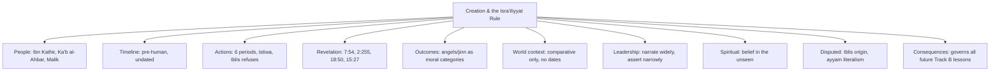

# Week 1 — Full Lesson Content

**Track A, Lesson 1:** Pre-Islamic Arabia and the Rise of Quraysh
**Track B, Lesson 1:** Ibn Kathīr's Method, the Isrā'īliyyāt Rule, and the Cosmological Opening

Each day = 2 hours: **Hour 1 = Track A** (0:00–0:60), **Hour 2 = Track B** (0:00–0:60), run back-to-back or split across the day as you prefer. Minute marks are a guide, not a stopwatch — adjust freely, the point is nothing gets skipped. Evidence labels: `[QUR'ANICALLY EXPLICIT]` `[SAHIH HADITH]` `[HASAN REPORT]` `[DISPUTED HADITH]` `[EARLY HISTORICAL REPORT]` `[WEAK REPORT]` `[ISRA'ILIYYAT]` `[EXTERNAL TRADITION]` `[LATER TRADITION]` `[MODERN HISTORICAL RECONSTRUCTION]` `[ARCHAEOLOGICAL EVIDENCE]` `[REASONED INFERENCE]` `[CHRONOLOGY UNCERTAIN]` `[REQUIRES VERIFICATION]`.

---

## TRACK A — LESSON 1: Pre-Islamic Arabia and the Rise of Quraysh

**A. Lesson Identity** — Track A · Module 9 · Lesson 1 · Period: pre-570 CE · Ibn Kathīr: opening genealogical/Quraysh sections of the Seerah portion of *al-Bidāyah wa'l-Nihāyah* `[REQUIRES VERIFICATION — exact chapter numbering depends on your edition]` · Total time this week: 7 hours (Days 1–7, 1 hr/day).

**B. Central Question** — Why did Makkah, a barren valley with no agriculture, become the religious and commercial center of Arabia, and how did Quraysh come to control it?

**C. Learning Outcomes** — By end of week you should be able to:
1. Describe Arabia's geography and how it shaped nomadic life and trade routes.
2. Explain the tribal/genealogical (*qabīlah*) system and place Quraysh within it.
3. Explain the Kaʿbah's religious and economic role before Islam.
4. Trace Quraysh's rise to custodianship of the Kaʿbah through Quṣayy ibn Kilāb.
5. Separate established historical reports from later embellished material about this period.
6. Name the two regional empires bordering Arabia and explain why neither absorbed it.

**D. Pre-Lesson Recall** — none; this is Lesson 1 of the track. From Day 2 onward every Track A lesson opens with 5 recall questions from the *previous* Track A lesson only.

---

### Day 1 (Hour 1) — Historical Foundation

**0–5 min — Central Question framing.** Read the Central Question above. Arabia had no empire of its own, no major river, no large-scale agriculture in the Hijaz — yet Makkah became indispensable to everyone around it. Hold that tension while reading.

**5–30 min — Primary reading.** Read Ibn Hishām's opening genealogical chapters (or Ibn Kathīr's parallel material) up to Quṣayy ibn Kilāb's consolidation of Quraysh's power over the Kaʿbah. Stop there. Question to hold in mind while reading: *what made Quṣayy's claim to authority stick, when earlier claimants' didn't?*

**30–55 min — Narrative reconstruction (established vs. disputed).**
- **Established / Qur'anically anchored:** Makkah sits in "a valley without cultivation" — Ibrāhīm's own description in his supplication `[QUR'ANICALLY EXPLICIT, Qur'an 14:37]`. The Kaʿbah's construction is linked to Ibrāhīm and Ismāʿīl `[QUR'ANICALLY EXPLICIT, Qur'an 2:127]`. Quraysh's economic life revolved around two great caravan journeys, winter and summer `[QUR'ANICALLY EXPLICIT, Qur'an 106:1–2]`.
- **Early historical report:** Quṣayy ibn Kilāb is reported to have united the scattered clans of Quraysh (previously living dispersed around Makkah) and brought custodianship of the Kaʿbah, control of pilgrim provisioning (*rifādah*), and other honors under one leadership, partly through marriage alliance and partly through assertive negotiation with the Khuzāʿah tribe who held the Kaʿbah before him `[EARLY HISTORICAL REPORT — Ibn Hishām/Ibn Kathīr; genealogical detail beyond this point is well-attested in the Arab genealogical tradition but not independently verifiable the way a dated inscription would be]`.
- **Chronology uncertain:** Exact dates for Quṣayy's life are not fixed; Arab tribal genealogy before roughly the mid-5th century CE is traditionally preserved but not independently datable `[CHRONOLOGY UNCERTAIN]`.
- **Do not conflate:** popular retellings sometimes dramatize Quṣayy's rise with invented dialogue or motives not in the early sources — stick to what Ibn Hishām/Ibn Kathīr actually report.

**55–60 min — Note for tomorrow.** Tomorrow's question: how does the Qur'an itself talk about Quraysh and the Kaʿbah, and what does authentic hadith say about Quraysh's status?

---

### Day 2 (Hour 1) — Qur'an and Hadith Layer

**D. Pre-Lesson Recall (5 Qs, from Day 1's material only):**
1. What phrase does Ibrāhīm use to describe Makkah in his supplication, and where is it found in the Qur'an?
2. Who is credited with uniting Quraysh's scattered clans and gaining control of the Kaʿbah?
3. From which tribe did Quṣayy reportedly gain control of the Kaʿbah?
4. What were the "two journeys" mentioned in Sūrat Quraysh?
5. Why is Quṣayy's exact date of life labeled `[CHRONOLOGY UNCERTAIN]` rather than given a firm year?

**G. Qur'anic Layer (20 min)**
- **Sūrah al-Fīl (105)** — Makkī. Arabic (first two verses): أَلَمْ تَرَ كَيْفَ فَعَلَ رَبُّكَ بِأَصْحَابِ الْفِيلِ﴿١﴾ أَلَمْ يَجْعَلْ كَيْدَهُمْ فِي تَضْلِيلٍ﴿٢﴾ — "Have you not seen how your Lord dealt with the companions of the elephant? Did He not make their plan go astray?" `[QUR'ANICALLY EXPLICIT]`. This refers to Abraha's expedition against the Kaʿbah, traditionally dated to the year of the Prophet ﷺ's birth (ʿĀm al-Fīl, "the Year of the Elephant"), though an inscription (the Murayghān inscription) has led some modern historians to place Abraha's campaign closer to 552 CE, earlier than 570 `[MODERN HISTORICAL RECONSTRUCTION / ARCHAEOLOGICAL EVIDENCE — the synchronization with the Prophet's ﷺ birth year is a traditional dating convention, not something the Qur'an itself asserts]`.
- **Sūrah Quraysh (106)** — Makkī, traditionally read alongside al-Fīl. Establishes Quraysh's economic dependence on the sanctuary and calls them to worship "the Lord of this House" who fed them and secured them from fear `[QUR'ANICALLY EXPLICIT]`. Key term: *rabb hādhā al-bayt* ("Lord of this House") — the surah's argument is essentially: your prosperity comes from the sanctuary's Lord, not the idols you've placed around it.

**H. Hadith Layer (20 min)**
- Hadith affirming that Allah chose Quraysh, and within Quraysh chose Banū Hāshim, and within Banū Hāshim chose the Prophet ﷺ — found in Ṣaḥīḥ Muslim, Book of Virtues (*al-Faḍā'il*) `[SAḤĪḤ HADITH — exact hadith number requires verification against your specific print edition]`. Historical value: establishes the Prophet ﷺ's genealogical standing was a live topic of report within the earliest generation, not a later embellishment — but treat it as a statement about lineage/selection, not as a historical narrative of *how* Quraysh rose to power (that's the Sīra material from Day 1).
- Caution: distinguish this authenticated hadith about lineage from the far more elaborate genealogical praise-poetry attributed to later narrators, which is literary in character and not hadith at all.

**20 min remaining — Reflection.** Write 2–3 sentences: what does it mean that the Qur'an addresses Quraysh's *economy* (trade security) before it addresses their *theology* (idols vs. the House's true Lord)? Hold this for Day 5's leadership/rhetoric discussion.

---

### Day 3 (Hour 1) — Classical Source Comparison

**D. Pre-Lesson Recall (5 Qs, Day 2 only):**
1. What does Sūrah al-Fīl describe?
2. What does the Murayghān inscription suggest about the traditional dating of Abraha's expedition?
3. What is Quraysh (106) traditionally read alongside?
4. What is the "argument" of Sūrah Quraysh in one sentence?
5. Which Ṣaḥīḥ collection contains the hadith on Allah's selection of Quraysh/Banū Hāshim?

**I. Ibn Kathīr's Method (15 min).** For this period Ibn Kathīr draws primarily on Ibn Isḥāq (via Ibn Hishām's recension), genealogists, and Qur'an/tafsīr material. He is transmitting inherited Arab genealogical tradition here, not applying isnād-criticism the way he does for a hadith report — so his authority on *dates* is weaker than his authority on *sequence of events*, which is broadly stable across sources.

**J. Classical Source Comparison Table (30 min)**

| Issue | Ibn Kathīr | Ibn Hishām/Ibn Isḥāq | Ibn Saʿd | al-Ṭabarī | Hadith evidence | Assessment |
|---|---|---|---|---|---|---|
| Who unified Quraysh's control of the Kaʿbah | Quṣayy ibn Kilāb | Same | Confirms genealogical line | Consistent | None directly (lineage hadith only) | Broadly agreed `[EARLY HISTORICAL REPORT]`; Qur'an is silent on the mechanism |
| From whom was control taken | Khuzāʿah | Same | Same | Same | — | Agreed across sources |
| Date of Quṣayy's life | Not fixed | Not fixed | Not fixed | Not fixed | — | `[CHRONOLOGY UNCERTAIN]` |
| Abraha's expedition date | Linked to birth year (traditional) | Same convention | — | Same convention | Qur'an confirms the event, not the year | `[MODERN HISTORICAL RECONSTRUCTION]` disputes exact synchronization; event itself `[QUR'ANICALLY EXPLICIT]` |

**15 min — Discussion note.** Where the table shows "agreed across sources," that agreement is expected — these authors are drawing on largely the same inherited material (Ibn Isḥāq is an ancestor source for much of what Ibn Kathīr, Ibn Saʿd, and al-Ṭabarī report), so convergence here is evidence of a shared transmission stream, not independent corroboration. Keep that distinction in mind for later modules where genuinely independent sources (e.g., Byzantine or Persian records) do corroborate Islamic sources.

---

### Day 4 (Hour 1) — World-History Connection

**D. Pre-Lesson Recall (5 Qs, Day 3 only):**
1. From which tribe did Quraysh take control of the Kaʿbah, per Ibn Kathīr and Ibn Hishām?
2. Why is Ibn Kathīr's authority on *dates* here weaker than his authority on *sequence*?
3. What does convergence across Ibn Kathīr, Ibn Hishām, Ibn Saʿd, and al-Ṭabarī on this material actually prove — and what does it not prove?
4. What does the Qur'an confirm about Abraha's expedition, and what does it not specify?
5. Name the two things the classical-source table agreed on without dispute.

**K. World-History Connection (40 min)**
- **Background conditions:** By the late 6th century CE, Arabia sat between two exhausted superpowers — the Byzantine (Eastern Roman) Empire to the northwest and Sasanian Persia to the northeast — locked in recurring wars. Neither empire fully absorbed central Arabia; both instead worked through client Arab tribal confederations on their frontiers (Byzantium through the Ghassānids, Persia through the Lakhmids) `[MODERN HISTORICAL RECONSTRUCTION, broadly accepted]`.
- **Direct connection:** Abraha, whose expedition against the Kaʿbah is described in Sūrah al-Fīl, was a Christian Aksumite (Ethiopian) viceroy ruling Yemen after Aksum's conquest of the Ḥimyarite kingdom — itself entangled with Byzantine-Persian rivalry, since Aksum was a Byzantine ally and Yemen later fell under Persian influence. This is covered in full in the Bridge lessons (Track B, Lessons 13–14) `[EARLY HISTORICAL REPORT for the broad outline; details of Abraha's motives and itinerary are less firmly fixed]`.
- **Relationship label:** Makkah's rise as trade center — strong contextual relationship to (not caused by) imperial exhaustion: when the more northern, empire-controlled routes became unsafe or costly during Byzantine-Persian wars, the Hijaz caravan route through Makkah gained relative importance `[REASONED INFERENCE — plausible and widely cited, but not something any single source states outright as cause-and-effect]`.
- **Contemporary but no proven connection:** exact GDP/trade-volume claims sometimes made about Makkah's caravan trade in popular literature are not well-evidenced; treat specific numeric claims about trade volume with caution unless sourced to a specific study.

---

### Day 5 (Hour 1) — Society, Everyday Life, Leadership

**D. Pre-Lesson Recall (5 Qs, Day 4 only):**
1. Name the two regional empires bordering Arabia in the late 6th century.
2. Through which client Arab tribes did each empire typically operate on its frontier?
3. Who was Abraha, and what was his connection to Aksum and Yemen?
4. What relationship label applies to "imperial wars pushed trade toward the Hijaz route"?
5. Why should specific trade-volume numbers about Makkah be treated cautiously?

**L. Society and Everyday Life (25 min).** Two ways of life coexisted in this world: **Bedouin nomadism** (herding, seasonal movement between pastures, tribal-honor codes, oral poetry as the primary literary and historical record) and **Makkan settled mercantile life** (caravan trade, pilgrimage-based hospitality economy, a council of clan elders rather than a king). Religion centered on the Kaʿbah, which by this period housed numerous idols alongside a residual monotheistic memory (the *ḥanīf* tradition, associated with figures who rejected idolatry while not formally adopting Judaism or Christianity `[EARLY HISTORICAL REPORT]`). Status varied by clan and gender; slavery existed as an accepted institution of the time, not unique to Arabia. Avoid two opposite errors: romanticizing this period as a lost golden age, or flattening it into pure "ignorance" — see Misconceptions below.

**M. Character and Leadership Analysis (20 min).** Quṣayy's consolidation of Quraysh is a leadership case study even before any prophetic material enters the picture: he combined a marriage alliance (into Khuzāʿah, the prior custodians) with patient assertion of authority once positioned to claim it, rather than a violent seizure `[EARLY HISTORICAL REPORT]`. This is a recurring pre-Islamic Arabian leadership pattern worth tagging now (see O2 below): coalition-building through kinship ties precedes and often substitutes for coercive force in tribal Arabia — a pattern the Seerah track will meet again in very different form in the Prophet ﷺ's own community-building in Madīnah (Module 17).

**15 min — Misconceptions and Controversies (N).** *Jāhiliyyah* (the term for this pre-Islamic period) is often mistranslated simply as "ignorance" in a blanket sense, suggesting Arabia had no poetry, law, or trade sophistication. More precisely it denotes a *moral/religious* condition — the absence of revealed guidance — not an absence of civilization: pre-Islamic Arabia had a developed oral poetic tradition (the *Muʿallaqāt*), customary law, and an active international trade network. Keep this distinction; it will matter when later lessons discuss what Islam changed versus what it inherited and reformed.

---

### Day 6 (Hour 1) — Consolidation

**D. Pre-Lesson Recall (5 Qs, Day 5 only):**
1. Name the two coexisting ways of life described for this period.
2. What is the *ḥanīf* tradition?
3. How did Quṣayy combine kinship and assertion in his rise to power?
4. What does *Jāhiliyyah* precisely denote, and what common mistranslation should be avoided?
5. Name one feature of pre-Islamic Arabian sophistication often erased by the "pure ignorance" misreading.

**Mind Map (15 min).** 13-branch structure — Central Event (Quraysh's consolidation of Makkah) → People (Quṣayy ibn Kilāb, Khuzāʿah, Quraysh clans) → Places (Makkah, the Kaʿbah, the Hijaz caravan route) → Timeline (`[CHRONOLOGY UNCERTAIN]`, generations before 570 CE) → Causes (marriage alliance, assertive negotiation) → Actions (uniting scattered clans, taking custodianship, control of pilgrim provisioning) → Revelation (Sūrahs al-Fīl and Quraysh, though revealed decades later, describe this world) → Outcomes (Quraysh's religious-commercial dominance of Arabia) → World context (Byzantine-Persian rivalry, Aksum/Yemen) → Leadership lessons (coalition over coercion) → Spiritual lessons (the House's true Lord vs. the idols placed around it — Sūrah Quraysh's argument) → Disputed reports (Abraha's exact date; embellished Quṣayy narrative details) → Long-term consequences (Makkah as the stage on which the Seerah opens).

```mermaid
graph TD
A[Quraysh's Consolidation of Makkah] --> B[People: Qusayy, Khuzaah, Quraysh clans]
A --> C[Places: Makkah, Kabah, Hijaz route]
A --> D["Timeline: pre-570 CE (uncertain)"]
A --> E[Causes: marriage alliance + assertion]
A --> F[Actions: uniting clans, custodianship]
A --> G[Revelation: Surahs al-Fil, Quraysh]
A --> H[Outcomes: religious-commercial dominance]
A --> I[World context: Byzantium-Persia, Aksum-Yemen]
A --> J[Leadership: coalition over coercion]
A --> K[Spiritual: true Lord of the House]
A --> L[Disputed: Abraha's date, embellishments]
A --> M[Consequences: stage for the Seerah]
```

**O3. Commercial Fluency — full treatment (15 min).** Pre-Islamic Makkah ran a **hospitality-and-transit economy**: it did not produce goods but monetized safe passage, provisioning, and pilgrimage hosting. Key vocabulary: *rifādah* (provisioning of pilgrims — a formal office held by Quraysh's leading clan), *siqāyah* (providing water to pilgrims, another formal office), *īlāf* (the security-pact system referenced in Sūrah Quraysh, by which Quraysh secured safe passage for its caravans through other tribes' territories — likely through a mix of payment, alliance, and reputation). This is the earliest form of a recurring pattern in the program: a settlement with no productive hinterland surviving by controlling and servicing a trade/pilgrimage corridor — the same structural logic later shows up in Madīnah's oasis economy and, in Track B, in the wilderness way-stations of the Exodus narrative.

**O4. Teaching Script — full 5–8 minute spoken script (audience: adult students, already practicing) (10 min to read/rehearse):**

> "Picture a valley with no river, no farmland, ringed by bare hills — and somehow it becomes the place every tribe in Arabia wants access to. That's Makkah before Islam. Not because of what grows there — nothing does — but because of what stands there: the Kaʿbah.
>
> Generations before the Prophet ﷺ was born, a man named Quṣayy ibn Kilāb saw that the clans of Quraysh were scattered, and that a neighboring tribe, Khuzāʿah, held the keys to the sanctuary. He didn't take it by force. He married in. He built alliances. And when the moment was right, he consolidated control — not just of the Kaʿbah's keys, but of the offices around it: who provides water to the pilgrims, who feeds them, who keeps the peace during the sacred months.
>
> That's the world the Qur'an is describing, centuries later, in Sūrah Quraysh — 'for the security of Quraysh, their security in the winter and summer journey.' Notice what the surah does next: it doesn't say 'so worship Me because I'm powerful.' It says: you already know Who secured your trade routes and fed you when there was no food here. So worship the Lord of *this House* — not the idols you've put up around it.
>
> Here's the tension worth sitting with: everything Quraysh valued — status, trade security, hospitality — it all ran through a sanctuary built, in the Islamic account, for the worship of one God. By the time the Prophet ﷺ is born into this same clan, that sanctuary is surrounded by idols. The very structure built for tawḥīd has become the site of its opposite. That's not incidental background — that's the wound the Seerah opens on."

---

### Day 7 (Hour 1) — Assessment

Closed-book. Write answers before checking the lesson content above.

1–10. **Active recall (10):** Where is Makkah described as having no cultivation, and by whom? Who consolidated Quraysh's control of the Kaʿbah? From which tribe? What two offices around the Kaʿbah are named in this lesson? What does Sūrah al-Fīl describe? What does the Murayghān inscription complicate? What is Sūrah Quraysh's central argument? Which Ṣaḥīḥ collection contains the hadith on Quraysh/Banū Hāshim's selection? Name the two 6th-century empires bordering Arabia. What does *īlāf* refer to?

11–15. **Why (5):** Why does the lesson label Quṣayy's dates `[CHRONOLOGY UNCERTAIN]` rather than giving a year? Why is source-agreement among Ibn Kathīr/Ibn Hishām/Ibn Saʿd/al-Ṭabarī here not treated as independent corroboration? Why does Sūrah Quraysh address economics before theology? Why is "Jāhiliyyah = pure ignorance" a misreading? Why does Abraha's story connect to Byzantine-Persian imperial politics?

16–18. **Cause-effect (3):** How did imperial wars plausibly affect the Hijaz trade route's importance? How did marriage alliance function as a cause of Quṣayy's rise? How does the Kaʿbah's idol-surrounded state by 570 CE set up the Seerah's opening tension?

19–20. **Source-evaluation (3, pick any two to answer in full):** Which claims in this lesson are `[QUR'ANICALLY EXPLICIT]` vs. `[EARLY HISTORICAL REPORT]` vs. `[MODERN HISTORICAL RECONSTRUCTION]` — give one example of each. Why is the *event* of Abraha's expedition on firmer ground than its *exact date*? What would make a Quṣayy-narrative detail worth flagging as embellished rather than accepted?

21–22. **Chronology (2):** Order these: Quṣayy's consolidation, Abraha's expedition, the Prophet ﷺ's birth. Which of the three has the least fixed date?

23. **Map from memory (1):** Redraw the mind map from Day 6 without looking.

24. **Two-minute oral explanation (1):** Explain to an imagined listener, in two minutes, why Makkah mattered before Islam and how Quraysh came to control it.

25. **Written analytical question (1):** "Sūrah Quraysh appeals to Quraysh's self-interest (trade security, food) as a route to theological argument. Is this a weaker or stronger rhetorical strategy than a direct theological appeal — and what does it assume about the audience?" (150–250 words)

Score: 90–100% Mastered · 75–89% Strong · 60–74% Developing · <60% Review required. Log any missed items in the Track A weakness register (missed fact | error type | correct answer | source | next review date: Day 3, then Day 7, then Day 14...).

---
---

## TRACK B — LESSON 1: Ibn Kathīr's Method, the Isrā'īliyyāt Rule, and the Cosmological Opening

**A. Lesson Identity** — Track B · Part I · Lesson 1 of 28 · Depth: Survey · Ibn Kathīr: opening chapters of *al-Bidāyah wa'l-Nihāyah*, Part I (creation of the heavens, the Throne, angels, jinn, Iblīs) `[REQUIRES VERIFICATION for exact chapter/page numbering in your edition]` · Total time this week: 7 hours.

**B. Central Question** — What rule does Ibn Kathīr himself lay down for handling material borrowed from Jewish and Christian tradition (Isrā'īliyyāt), and why does the material about creation need that rule more than almost any other part of his book?

**C. Learning Outcomes:**
1. State Ibn Kathīr's own three-category rule for Isrā'īliyyāt material.
2. Explain why creation-era material is especially exposed to Isrā'īliyyāt.
3. Summarize what is Qur'anically stated about the Throne (*ʿArsh*) and Footstool (*Kursī*) versus what is later theological elaboration.
4. Distinguish belief in angels and jinn as an article of faith from specific narrative details about them.
5. Explain Iblīs's Qur'anic role and where popular stories about him go beyond the text.

---

### Day 1 (Hour 1) — Historical Foundation: Ibn Kathīr and His Method

**0–10 min — Who is Ibn Kathīr.** ʿImād al-Dīn Ismāʿīl ibn ʿUmar Ibn Kathīr (c. 701–774 AH / c. 1300–1373 CE), a Damascene scholar of hadith, tafsīr, and history, student in the circle of Ibn Taymiyyah `[EARLY HISTORICAL / widely reported biographical detail — exact birth year has minor variation across biographical dictionaries, `[REQUIRES VERIFICATION]` against a specific biographical source]`. *Al-Bidāyah wa'l-Nihāyah* ("The Beginning and the End") is his universal history: from creation, through the prophets, the Seerah, the Rāshidūn and later Islamic history, up to his own lifetime, followed by an eschatological section (*al-Nihāyah*, "the End" — covered in Part IV, Lesson 26 of this program).

**10–35 min — Ibn Kathīr's stated method for Isrā'īliyyāt.** In his tafsīr (and reflected in his historical writing), Ibn Kathīr articulates a threefold rule inherited from earlier scholars (traced to Ibn Taymiyyah among others) for reports drawn from Jewish/Christian tradition:
1. Material **confirmed** by the Qur'an or authentic hadith — accepted as true, on the authority of the Islamic source, not the borrowed one.
2. Material **contradicted** by the Qur'an or authentic hadith — rejected outright.
3. Material that is **neither confirmed nor contradicted** — neither affirmed nor denied; it may be *narrated* for interest, but not relied upon for belief or law `[This threefold rule is well-attested as Ibn Kathīr's stated methodology; exact wording varies by which of his works you're quoting from — his Qur'an commentary (tafsīr) states it most explicitly, and he applies it, with less commentary each time, throughout al-Bidāyah — REQUIRES VERIFICATION for a precise quotation and citation before using it as a direct quote in teaching]`.

**35–55 min — Why creation-era material is exposed.** The Qur'an gives a *theologically dense but narratively sparse* account of creation: it establishes that Allah created the heavens and earth in six periods (*ayyām*, not necessarily "days" in the human sense) `[QUR'ANICALLY EXPLICIT, e.g. Qur'an 7:54, 11:7]`, that He is established upon the Throne, that angels and jinn exist, that Iblīs refused to prostrate to Ādam. It does *not* narrate creation as a continuous story with the texture of the Genesis narrative. That narrative gap is exactly where Isrā'īliyyāt material — much of it originating in Jewish Midrashic and Christian traditions describing the six days hour-by-hour, the ranks and names of angels in elaborate detail, or Iblīs's biography before his refusal — has historically flowed in, often through early Muslim converts from Jewish or Christian backgrounds (e.g., Kaʿb al-Aḥbār, Wahb ibn Munabbih) reporting what they knew from their prior tradition `[EARLY HISTORICAL REPORT for the transmission pathway; the content transmitted is `[ISRA'ILIYYAT]` by definition]`.

**55–60 min — Note for tomorrow.** Tomorrow: what does the Qur'an actually, explicitly say about the Throne and Footstool — separated cleanly from later elaboration.

---

### Day 2 (Hour 1) — Qur'an and Hadith Layer: ʿArsh, Kursī, Heavens and Earth

**D. Pre-Lesson Recall (5 Qs, Day 1 only):**
1. What are Ibn Kathīr's three categories for Isrā'īliyyāt material?
2. Name two early narrators associated with transmitting Isrā'īliyyāt into Muslim scholarship.
3. What does the Qur'an say about the number of periods in which the heavens and earth were created?
4. Why is creation-era material described as "narratively sparse but theologically dense"?
5. In what century (AH) did Ibn Kathīr live?

**G. Qur'anic Layer (30 min).**
- **al-ʿArsh (the Throne):** Allah's istiwā' ("rising above" / "establishment") upon the Throne is stated repeatedly `[QUR'ANICALLY EXPLICIT, e.g. Qur'an 7:54, 20:5, 57:4]`. The classical Sunni position (associated with the early salaf and reflected in Ibn Kathīr's own theological orientation) is to affirm the wording without specifying the modality (*bi-lā kayf*, "without asking how") — a position summed up in a statement attributed to Imām Mālik when asked about istiwā': "the *istiwā'* is known, the *how* is unknown, believing in it is obligatory, and asking about it is an innovation" `[HASAN/frequently-cited scholarly report — exact isnād and grading of this specific narration from Mālik `[REQUIRES VERIFICATION]`, though the position it expresses is the standard early-Sunni one]`.
- **al-Kursī (the Footstool):** Mentioned explicitly in Āyat al-Kursī, described as encompassing the heavens and earth `[QUR'ANICALLY EXPLICIT, Qur'an 2:255]`. Classical scholarship generally distinguishes Kursī from ʿArsh as two separate, immense created realities, without claiming certainty about their exact relationship beyond what the text states `[EARLY HISTORICAL REPORT / scholarly consensus with some variation in detail]`.
- **What is NOT Qur'anically stated:** precise physical dimensions, materials, or a narrative "tour" of the Throne — these appear only in later, weaker reports and should be flagged `[WEAK REPORT]` or `[LATER TRADITION]` when encountered, not treated as part of the core creed.

**H. Hadith Layer (20 min).** The hadith of the Throne resting upon water before creation of the heavens and earth is reported in Ṣaḥīḥ al-Bukhārī `[SAḤĪḤ HADITH — exact number `[REQUIRES VERIFICATION]`]`. This is one of the few narrative threads about pre-creation reality that has authentic hadith backing, which is precisely why it's treated differently in this program from the many Isrā'īliyyāt elaborations that lack any such backing — the presence or absence of an authentic hadith is the dividing line, not how interesting or widespread a report is.

**10 min — Reflection.** Notice the pattern forming: Qur'an + authentic hadith give a *skeleton*; everything filling in beyond that skeleton needs its source checked before you repeat it as fact. This is the single most important habit this lesson is building.

---

### Day 3 (Hour 1) — Classical Source Comparison: Angels, Jinn, and the Method Applied

**D. Pre-Lesson Recall (5 Qs, Day 2 only):**
1. What is the classical "bi-lā kayf" position regarding istiwā'?
2. What does Āyat al-Kursī explicitly say the Kursī encompasses?
3. Which collection contains the hadith of the Throne upon water before creation?
4. What is NOT stated in the Qur'an about the Throne's physical properties?
5. What is the "dividing line" this lesson is teaching you to check before repeating a creation-era claim?

**I. Ibn Kathīr's Method Applied (20 min).** When Ibn Kathīr reaches the sections on angels and jinn in *al-Bidāyah*, he typically states the Qur'anically/hadith-established core first (their existence, some named angels and their roles, jinn as a created type distinct from angels and humans, made from smokeless fire `[QUR'ANICALLY EXPLICIT, Qur'an 15:27, 55:15]`), then *separately* notes where later reports elaborate — often naming Kaʿb al-Aḥbār or similar figures as the source of the more detailed material, which is itself a signal (per his own stated rule) that the material falls into category 2 or 3 above rather than category 1.

**J. Classical Source Comparison Table (30 min).**

| Issue | Ibn Kathīr | Qur'an/Hadith baseline | Common Isrā'īliyyāt elaboration | Assessment |
|---|---|---|---|---|
| Existence of angels | Affirmed, article of faith | `[QUR'ANICALLY EXPLICIT]` — e.g. Qur'an 2:285 | Elaborate rank-and-file hierarchies, specific numbers | Core existence firm; hierarchy detail `[LATER TRADITION]`/`[ISRA'ILIYYAT]` |
| Angels' nature | Created from light | `[SAHIH HADITH, Sahih Muslim — exact number REQUIRES VERIFICATION]` | Elaborate physical descriptions | Core firm; excess detail unverified |
| Jinn's nature | Created from "smokeless fire" | `[QUR'ANICALLY EXPLICIT]` | Detailed jinn-society narratives | Core firm; narrative elaboration weak/unsourced |
| Iblīs's origin | From the jinn, refused to prostrate | `[QUR'ANICALLY EXPLICIT, Qur'an 18:50 states he was of the jinn]` | Pre-refusal "biography" as a righteous angel for eons | `[ISRA'ILIYYAT]` — not in Qur'an/hadith; widely repeated but unsourced to Islamic primary texts |

**10 min — Key takeaway.** Iblīs being "of the jinn" is explicit in the Qur'an (18:50) — a detail that corrects a very common popular assumption that he was originally an angel. This is worth flagging clearly because it's one of the more consequential misconceptions in casual Islamic teaching, not a minor footnote.

---

### Day 4 (Hour 1) — World-History Connection (Comparative, Conceptual Only)

**D. Pre-Lesson Recall (5 Qs, Day 3 only):**
1. What signal does Ibn Kathīr give when he names Kaʿb al-Aḥbār as the source of a creation-era detail?
2. What are jinn created from, per the Qur'an?
3. What common misconception does Qur'an 18:50 correct regarding Iblīs?
4. What are angels created from, per the cited hadith?
5. Why does the comparison table separate "core" from "elaboration" for every single row?

**K. World-History Connection — Comparative, NOT evidentiary (40 min).** Per the program's own design rule for Part I: world-history content here is *conceptual only* — used to isolate what's distinctively Qur'anic from later accretion, never as proof or disproof of either tradition, and given no dates.
- Ancient Mesopotamian cosmologies (e.g., Babylonian creation narratives) and the Hebrew Bible's Genesis account both describe creation as an extended narrative with day-by-day texture `[EXTERNAL TRADITION]`.
- The Qur'an's creation material is comparatively terse — establishing *that* Allah created in six periods and is established upon the Throne, without the narrative elaboration found in those traditions `[QUR'ANICALLY EXPLICIT for what it does say; REASONED INFERENCE for the comparative observation itself]`.
- **Why this matters for the Isrā'īliyyāt rule:** the gap between the Qur'an's terseness and the surrounding traditions' narrative richness is *precisely* the space early converts from Jewish and Christian backgrounds filled in with familiar material — which is why Ibn Kathīr's rule exists specifically for this material, more than for almost any other part of his book. This is a conceptual/structural point, not a claim that any specific external tradition is a "source" for the Qur'an — that framing is explicitly rejected within Islamic theology and is outside this program's scope to adjudicate.

---

### Day 5 (Hour 1) — Society, Everyday Life, Leadership (Adapted for Part I)

Because Part I lessons describe cosmology rather than lived human society, Sections L and M are adapted rather than skipped:

**L. "Society" adapted — Devotional and Theological Life (25 min).** How belief in the unseen (*ghayb* — angels, jinn, the Throne) functioned as a foundational article of faith for the earliest Muslim community: it shaped daily practice (e.g., angelic presence during prayer and at death, per hadith), moral accountability (jinn and humans both addressed as morally responsible, per Qur'an 51:56), and protective supplication practices referencing Iblīs's enmity (e.g., seeking refuge from Satan, *istiʿādhah*, before Qur'an recitation) `[QUR'ANICALLY EXPLICIT for the practice's textual basis, Qur'an 16:98]`.

**M. "Leadership" adapted — Ibn Kathīr's Scholarly Discipline as a Model (20 min).** The leadership lesson here is methodological, not political: Ibn Kathīr models intellectual restraint — narrating widely but committing belief narrowly. That is itself a transferable discipline: distinguishing what you report from what you assert as true is a leadership skill in teaching, not just a historian's technicality — it is what earns an audience's long-term trust.

**15 min — N. Misconceptions and Controversies.** Two common ones to correct explicitly: (1) "Iblīs was originally an angel who fell" — contradicted by Qur'an 18:50 as noted above `[QUR'ANICALLY EXPLICIT correction]`; some argue he was an angel commanded along with them, a minority position with less textual support — flag as `[DISPUTED]` if you encounter it, but the majority and stronger-evidenced position is that he was jinn. (2) "The six days of creation are six 24-hour days as humans experience them" — the term *ayyām* (periods) used in these verses is not necessarily equivalent to a solar day, and classical exegetes have discussed this term's flexibility; treat strict 24-hour literalism as one exegetical position among others rather than the only possible reading `[REASONED INFERENCE based on standard tafsīr discussion of the term; REQUIRES VERIFICATION against specific tafsīr works if teaching this point in detail]`.

---

### Day 6 (Hour 1) — Consolidation

**D. Pre-Lesson Recall (5 Qs, Day 5 only):**
1. Name one daily practice shaped by belief in the unseen.
2. What Qur'anic verse grounds the practice of seeking refuge from Satan before recitation?
3. What is the "leadership lesson" this lesson draws from Ibn Kathīr's method?
4. What is the minority position on Iblīs's origin, and why is it flagged `[DISPUTED]` rather than accepted outright?
5. Why shouldn't strict 24-hour literalism be treated as the only possible reading of *ayyām*?

**Mind Map (15 min).** Central Event (creation, and the rule for narrating it) → People (Ibn Kathīr, Kaʿb al-Aḥbār as a named Isrā'īliyyāt transmitter, Imām Mālik on istiwā') → Places (n/a — cosmological, not geographic) → Timeline (pre-human; not dated) → Causes (n/a) → Actions (Allah's creation in six periods, istiwā' upon the Throne, Iblīs's refusal) → Revelation (Qur'an 7:54, 2:255, 18:50, 15:27, 16:98) → Outcomes (angels/jinn as created moral categories; Iblīs as enemy) → World context (comparative-only: Mesopotamian/Biblical narrative density vs. Qur'anic terseness) → Leadership lessons (narrate widely, assert narrowly) → Spiritual lessons (belief in the unseen as foundational; protective supplication) → Disputed reports (Iblīs's pre-refusal status; *ayyām* literalism) → Long-term consequences (this method governs every remaining lesson in Track B).

**O3. Commercial Fluency — brief note (this lesson has no direct commercial content; full treatment resumes at a lesson where it applies, e.g. Yūsuf/Egypt in Part II).**

**O4. Teaching Script — full 5–8 minute spoken script (audience: adult students, already practicing):**

> "Here's a habit worth building before we go one lesson further into this book: every time Ibn Kathīr tells you something about creation — before Ādam, before humanity, before anything you could call history — ask one question: is this from the Qur'an or an authentic hadith, or is this from someone repeating what they used to believe before Islam?
>
> Ibn Kathīr himself gives you the rule. Three categories: what the Qur'an or authentic hadith confirms — accept it, on that authority. What they contradict — reject it, full stop. And what they neither confirm nor deny — you can mention it, but you don't build belief on it.
>
> Why does this matter more here than almost anywhere else in the book? Because the Qur'an's account of creation is short. Six periods, the Throne, the Footstool, angels, jinn, Iblīs's refusal — that's the skeleton. It doesn't walk you hour-by-hour through six days the way Genesis does. And that gap — between how little the Qur'an narrates and how much curiosity a listener naturally has — is exactly where converts like Kaʿb al-Aḥbār, coming from a Jewish scholarly background, filled in details from what they already knew. Some of it may be true. Some of it isn't. None of it is binding, because none of it carries the authority the Qur'an and authentic hadith carry.
>
> Take one example that trips people up constantly: was Iblīs originally an angel who fell? Say it clearly — the Qur'an itself answers this. Surah al-Kahf, verse 50: he was of the jinn. Not a fallen angel. A jinn who was commanded to prostrate along with the angels, and refused. That's not a small correction — it changes how you understand obedience, refusal, and what kind of creature can defy a direct command.
>
> That's the discipline this whole book is going to test in you: can you tell a story faithfully — the way Ibn Kathīr does, narrating even the disputed material — without quietly letting the disputed material become, in your own mind or your listener's, part of what you actually believe?"

---

### Day 7 (Hour 1) — Assessment

1–10. **Active recall:** State Ibn Kathīr's three-category rule for Isrā'īliyyāt. Name two early figures associated with transmitting Isrā'īliyyāt. How many periods does the Qur'an say creation took? What does Āyat al-Kursī say the Kursī encompasses? What are jinn created from? What are angels created from (per hadith)? What is Iblīs's origin per Qur'an 18:50? What is the "bi-lā kayf" position? Which collection carries the Throne-upon-water hadith? What practice is grounded in Qur'an 16:98?

11–13. **Why (5, answer any 3 in full):** Why is creation-era material especially exposed to Isrā'īliyyāt? Why does Ibn Kathīr naming a transmitter like Kaʿb al-Aḥbār function as a signal, not just a citation? Why is strict 24-hour literalism for *ayyām* treated as one position rather than the only one? Why does this lesson treat world-history material as "comparative only, no dates" rather than evidentiary? Why is "narrate widely, assert narrowly" called a leadership skill?

14–16. **Cause-effect (3):** How does the Qur'an's narrative terseness about creation lead to a specific historical transmission pattern (via named converts)? How does the presence/absence of authentic hadith backing change how a creation-era claim should be labeled? How does correcting "Iblīs was a fallen angel" change a listener's understanding of the prostration command?

17–18. **Source-evaluation (2):** Give one example each of a claim in this lesson labeled `[QUR'ANICALLY EXPLICIT]`, `[SAHIH HADITH]`, and `[ISRA'ILIYYAT]`. What would move a piece of creation-era material from "safe to narrate" to "must reject outright" under Ibn Kathīr's rule?

19–20. **Chronology (2):** This lesson explicitly avoids dating creation-era events — why is that itself a chronology lesson? What comes first in the Qur'anic account discussed this week: the creation of the heavens/earth, or Iblīs's refusal?

21. **Map from memory:** Redraw the Day 6 mind map without looking.

22. **Two-minute oral explanation:** Explain Ibn Kathīr's Isrā'īliyyāt rule and why it exists, to an imagined listener, in two minutes.

23. **Written analytical question (150–250 words):** "Ibn Kathīr chooses to narrate Isrā'īliyyāt material he does not believe should be relied upon, rather than omitting it entirely. Is that the right editorial choice for a historian, or would silence have been safer? What does his choice assume about his readers?"

---

## Cross-Track Note (do not formally assess yet — this convergence question belongs to Module/Part consolidation, not Week 1)

Hold this question loosely through the week rather than answering it now: both lessons this week open with a *method* before a *narrative* — Track A opens by separating established fact from embellishment in Quṣayy's story; Track B opens by separating Qur'an/hadith from Isrā'īliyyāt in creation's story. Notice, don't answer yet: is that structural echo a coincidence of how this program was designed, or does it reflect something real about how both the Seerah and the wider Islamic historical tradition need to be read?

---

## This Week's Additions to the Progress Trackers

| Track | Lesson | Status after Week 1 | Recall scores logged Day 2/3/4/5/6/7 | Next spaced review |
|---|---|---|---|---|
| A | Lesson 1 — Pre-Islamic Arabia and the Rise of Quraysh | In progress → mark Complete after Day 7 assessment | *(fill in as you go)* | Day 3, Day 7, Day 14, Day 30... from completion date |
| B | Lesson 1 — Ibn Kathīr's Method and the Cosmological Opening | In progress → mark Complete after Day 7 assessment | *(fill in as you go)* | Day 3, Day 7, Day 14, Day 30... from completion date |

Log any Day-7 misses into each track's own weakness register (missed fact | error type | correct answer | source | next review date) — keep the two registers separate, per the program's retention rules.
